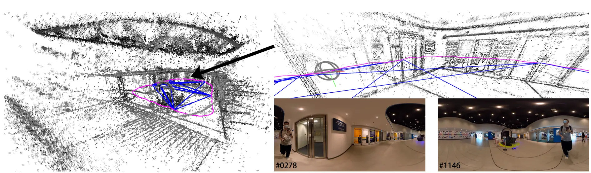

This paper was presented in #ICRA-2022 

This project is about #VSLAM (i.e., #SLAM systems based on visual information) using #360-cameras (also known as panorama cameras)

The main takeaway from this project is the direct approach, i.e., using pixel intensities rather than feature points. This is similar to LSD-SLAM, DSO, and SVO, but for 360-camera projection. 

